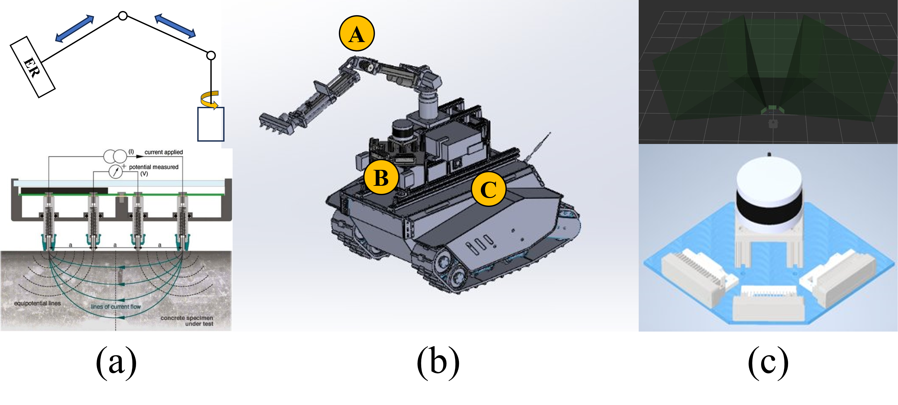

# Multi-Sensor Underground Autonomous Inspection Platform

**The effective operation of civil infrastructure is crucial for economic stability. To ensure continued performance,regular maintenance is essential. However, underground infrastructure, like culverts and tunnels, posed more significant challenges in managing and preserving these critical assets suchas maneuverability and anger, slow labor-intensive, defect lo-calization, and superficial assessment. In this paper, we proposea cost-effective solution for infrastructure inspection through the development of an autonomous multi-sensor inspection robot platform. Our solution integrates multiple RGBD cam-eras, a LiDAR, a deep learning based defect etection system, lighting systems, and non-destructive evaluation (NDE) tech-niques for a comprehensive condition assessment. In addition,we integrate a Partially Observable Markov Decision Process(POMDP) framework to find and assess defect areas in confinedand unstructured underground environments. Furthermore, weprovide an open-ource implementation of our framework on GitHub. [[Paper](https://github.com/aralab-unr/MUAIP/blob/main/paper/ICRA2025_Chuong-1_compressed.pdf)]**
<p align='center'>
    
</p>

## Dependencies
The framework has been tested with ROS Noetic and Ubuntu 20.04. The following configuration, along with the required dependencies, has been verified for compatibility:

- [Ubuntu 20.04](https://releases.ubuntu.com/focal/)
- [ROS Noetic](http://wiki.ros.org/noetic/Installation/Ubuntu) 
- [Depthai Dependencies](https://docs.luxonis.com/software/ros/depthai-ros/build/)
- [CUDA](https://developer.nvidia.com/cuda-downloads) (Recommend to use CUDA toolkit >= 11 for Ubuntu 20.04)
- [ultralytics](https://github.com/ultralytics)

```
cd <ros workspace>/src
git clone 
cd ..
catkin build culvert_sim 
```
Put [bigger_rough_3crack_2spall](https://github.com/khuechuong/culvert_sim/tree/main/model/bigger_rough_3crack_2spall) and all other model folder in ```.gazebo/model``` folder

```
roscd culvert_sim
cd model
mv bigger_rough_3crack_2spall ~/.gazebo/model/
```

